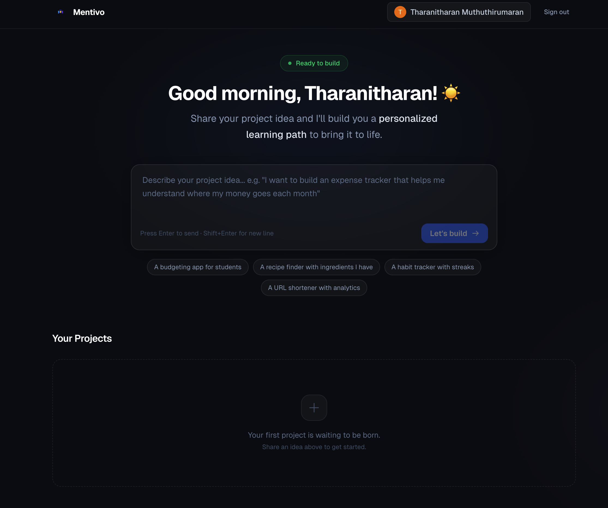
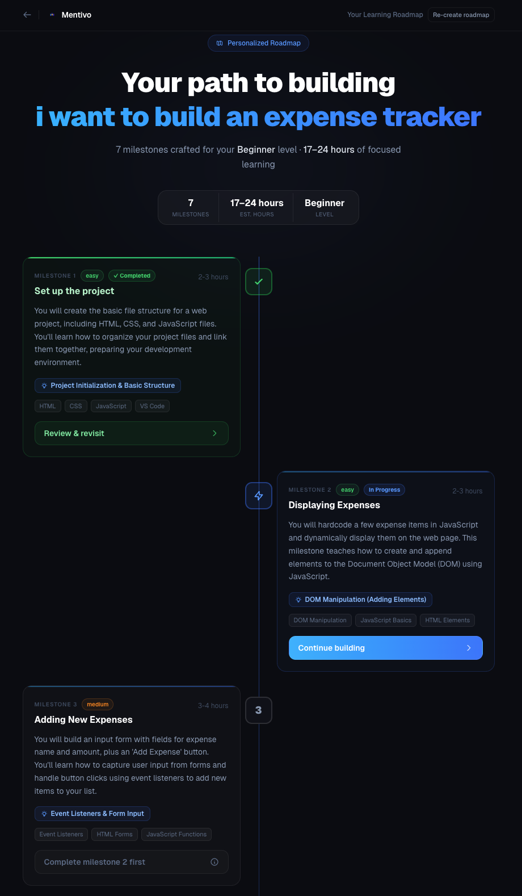
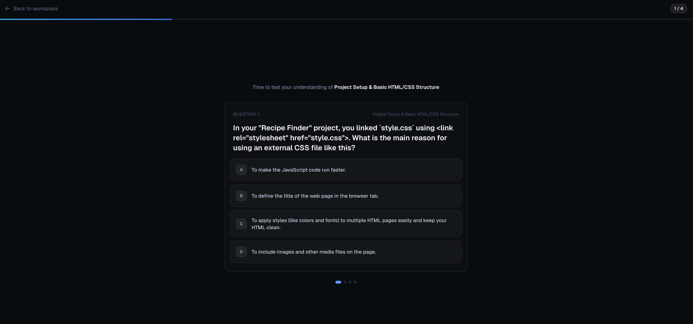

# Mentivo

An AI-powered learning platform that teaches you web development by having you build something you actually care about.

---

## The Problem

Most people who want to learn web development hit the same wall. They watch tutorials, follow along, and feel like they understand it. Then they close the video and try to build something on their own, and nothing comes together.

The rise of AI tools made this worse in a different way. Now you can describe what you want and have it write all the code for you in seconds. The app gets built, but you have no idea what happened. You copy and paste, tweak a few things, and eventually you have something that sort of works, but you could not explain a single line of it if someone asked.

There is no real learning happening. Just delegation.

---

## The Solution

Mentivo is an AI coding mentor, not an AI code generator. The difference matters.

You start by describing the project you want to build, something real that you actually want to exist. Mentivo figures out a focused, achievable version of that idea, assesses where you are starting from, and creates a personalized roadmap for you. Then it walks you through building it, milestone by milestone.

At every step, it teaches you the concept you need before you write a single line. You write the code yourself in a browser-based editor. You see it run in a live preview. And before you move on, Mentivo makes sure you actually understood what just happened.

The AI is there the whole time if you get stuck, but it will not just hand you the answer. It asks questions, gives hints, and nudges you in the right direction. By the time you finish, you have a working project and you can genuinely explain how it works.

---

## How It Works

### You start with an idea

When you log in, you land on a simple dashboard. There is a text input asking what you want to build. You type something like "I want to build an expense tracker that helps me understand where my money goes each month" and hit send.

Mentivo takes that idea and runs with it.



### You get a roadmap built for you

Based on your idea and your current skill level, Mentivo generates a personalized learning roadmap. It breaks the project into milestones in the right order, estimates how long each one will take, and tells you exactly what concept you will learn at each step.

You can see which milestones are done, which one you are on, and what is coming next. Everything is scoped to beginner, intermediate, or advanced depending on where you are starting from.



### You actually write the code

When you open a milestone, the screen splits into three parts. On the left there is a plain-English explanation of the concept you are about to use, with a clear task at the bottom telling you what to build. In the middle is a code editor where you write everything yourself. On the right is a live preview that updates as you type so you can see exactly what your code is doing.

If you are stuck, there is an AI assistant on the right side that you can talk to. It will not write the code for you, but it will help you think through the problem.


### You prove you understood it

After you finish each milestone, Mentivo does not just let you move on. It runs a short quiz based on the concept you just worked with. The questions are grounded in what you actually built, so it is testing real understanding, not memorization.

This is the part most learning tools skip. Mentivo does not.



---

## How I Built It

- **Framework:** Next.js 16 with TypeScript
- **Styling:** Tailwind CSS
- **Database:** Neon (serverless Postgres) with Prisma
- **AI:** Google Gemini via the Vercel AI SDK
- **Auth:** NextAuth v5 with Google OAuth
- **Code Editor:** Monaco Editor
- **Deployment:** Vercel

---

## Running It Locally

Clone the repo and install dependencies.

```bash
git clone https://github.com/your-username/mentivo.git
cd mentivo
npm install
```

Create a `.env.local` file in the root and fill in the following.

```bash
# Google Gemini (get your key from https://aistudio.google.com/app/apikey)
GOOGLE_GENERATIVE_AI_API_KEY=

# Google OAuth (from https://console.cloud.google.com)
GOOGLE_CLIENT_ID=
GOOGLE_CLIENT_SECRET=

# NextAuth
NEXTAUTH_SECRET=
NEXTAUTH_URL=http://localhost:3000

# Neon database connection string
DATABASE_URL=
```

Push the database schema.

```bash
npx prisma db push
```

Start the dev server.

```bash
npm run dev
```

Open [http://localhost:3000](http://localhost:3000) and you are good to go.
